# Melody Mapper
## Table of Contents

- [Melody Mapper](#melody-mapper)
  - [Table of Contents](#table-of-contents)
  - [Requirements and Specification Document](#requirements-and-specification-document)
    - [Project Abstract](#project-abstract)
    - [Customer](#customer)
    - [Requirements](#requirements)
    - [Use Cases \& User Stories](#use-cases--user-stories)
    - [User Interface Requirements](#user-interface-requirements)
    - [Security Requirements](#security-requirements)
    - [System Requirements](#system-requirements)
    - [Specification](#specification)
      - [Technology Stack](#technology-stack)
      - [Database Schema](#database-schema)
      - [Class Diagram](#class-diagram)
      - [Flowchart](#flowchart)
      - [Behavior](#behavior)
      - [Sequence Diagram](#sequence-diagram)
    - [Standards \& Conventions](#standards--conventions)
      - [Coding Standards](#coding-standards)
      - [Formatting Conventions](#formatting-conventions)
      - [Naming Conventions](#naming-conventions)
      - [Comment Conventions](#comment-conventions)
      - [File Headers Conventions](#file-headers-conventions)
- [Development](#development)
- [Running Development Environment with Docker Compose](#running-development-environment-with-docker-compose)
  - [Prerequisites](#prerequisites)
  - [Steps to Run](#steps-to-run)
  - [Tips for Development](#tips-for-development)
  - [FAQ](#faq)
- [Deployment](#deployment)
  - [Log into CSL VM](#log-into-csl-vm)
  - [Clone the Repository](#clone-the-repository)
  - [Build and Run Containers](#build-and-run-containers)
  - [Verifying Deployment](#verifying-deployment)
  - [Updating the Deployment](#updating-the-deployment)
  - [Notes](#notes)

## Requirements and Specification Document


[](https://git.doit.wisc.edu/cdis/cs/courses/cs506/sp2024/team/mondaywednesdaylecture/T_05/MelodyMapper/-/commits/develop) [](https://git.doit.wisc.edu/cdis/cs/courses/cs506/sp2024/team/mondaywednesdaylecture/T_05/MelodyMapper/-/commits/develop)

### Project Abstract

Melody Mapper is an application designed to convert voiced melodies into MIDI format. Users can input melodies through voice, and the application will transform them into MIDI representation, allowing for storage and playback. This functionality enables users to easily capture and manipulate melodies for various purposes, such as music composition, analysis, or playback.

### Customer

The target customer for this software spans musicians, composers, music producers, and enthusiasts who engage in the creation and manipulation of melodies. Specifically, individuals who seek efficient methods to transcribe melodies from voice to MIDI format for further exploration, modification, or integration into their creative projects would find this application valuable. Moreover, educators and students in music-related fields could benefit from its functionality for educational purposes, facilitating learning and experimentation with musical concepts.

### Requirements

| ID   | Description                                                                                                                                                                                      | Priority | Status   |
| ---- | ------------------------------------------------------------------------------------------------------------------------------------------------------------------------------------------------ | -------- | -------- |
| R001 | The system shall send an mp3, m4a, wav, or webm file and metadata from the UI to the backend to be processed                                                                                     | High     | Complete |
| R002 | The system shall convert the mp3, m4a, wav, or webm file sent to the backend into a MIDI format                                                                                                  | High     | Complete |
| R003 | The system shall send the MIDI data and file metadata to the database for storage                                                                                                                | High     | Complete |
| R004 | The system shall receive a request from a user to retrieve MIDI data from the database                                                                                                           | High     | Complete |
| R005 | The system shall process a request for MIDI data and query the database for results                                                                                                              | High     | Complete |
| R006 | The system shall return a series of matching MIDI files found by the database query to the user                                                                                                  | High     | Complete |
| R007 | The system shall sort according to filename, author and date of the list of midi files in the database                                                                                           | High     | Complete |
| R008 | The system shall allow a user to download the sheet music for a midi recording using musicxml format                                                                                             | High     | Complete |
| R009 | The system shall allow users to credit other artists besides themselves during upload                                                                                                            | Low      | Complete |
| R010 | The system shall be able to search for the filename or author in the database                                                                                                                    | Medium   | Complete |
| R011 | The system shall allow users to download midi file of a song in the database                                                                                                                     | High     | Complete |
| R012 | The system shall prompt a users to enter metadata regarding an recording or uploaded file                                                                                                        | High     | Complete |
| R013 | The system shall prompt a users with the security statement before allowing them to record or upload any files                                                                                   | High     | Complete |
| R014 | The system shall show the user a history of all the uploads to the database in table form, prompting the user with download buttons for musicxml and midi formats as well as displaying metadata | High     | Complete |
| R015 | The system shall be designed to run within Docker containers, utilizing Dockerfiles and Docker Compose for containerization and portability of the program                                       | Medium   | Complete |
| R016 | The system shall consist of two MySQL database tables, users and midi, consisting of user metadata and midi metadata/file respectively                                                           | High     | Complete |

### Use Cases & User Stories

1. As the user of the websites, in order to record the recording, the user will be able to record, playback and download the audio they recorded.
    - Once the user is satisfied with the recording, the user will be prompted to name the recording, author the audio recording, and credit other users.
    - Once the user submits the recording for conversion, the resulting MIDI file will be returned and displayed as a music sheet.
2. As the user of the website, the user will be able to see a list of converted recordings.
    - The list contains all the converted recordings that all the users have created in the database.
3. As the user of the website, the user can see a history of the converted recordings they have done.
4. As the user of the website, the user will be able to download the converted audio recording in a MIDI file format.
5. As the user of the website, the user will be able to search the uploaded and converted files.

### User Interface Requirements

The website applicatoins will have the following screens:

1. A security statement will be presented to the user before they can continue to the website
2. A main screen will show a record button, a file upload button, and conversion history where a user can download the midi file or xml sheet music for pervious uploaded recordings
3. Once the Start Recording button is pressed, the user will see an active recording screen
4. The user will be prompted to review their recording, and submit it for conversion
5. The user will be prompted to input details about the recording
6. The user will then be prompted if the upload and conversion had an error or if it was successful

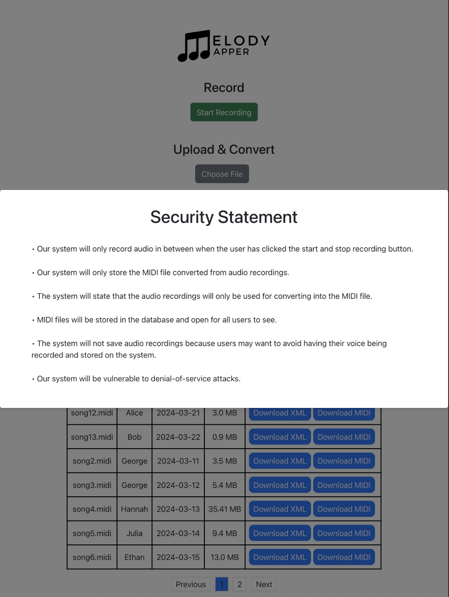
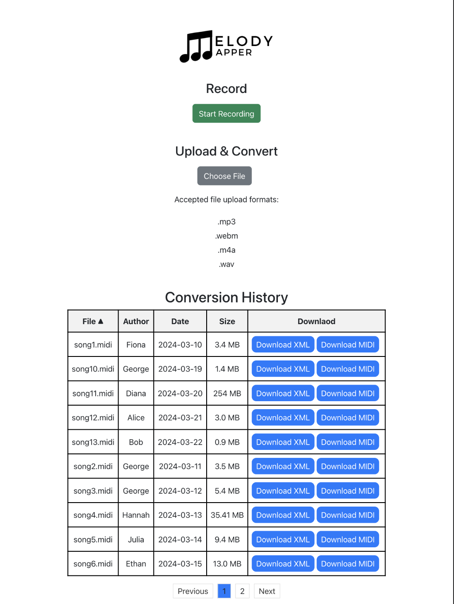
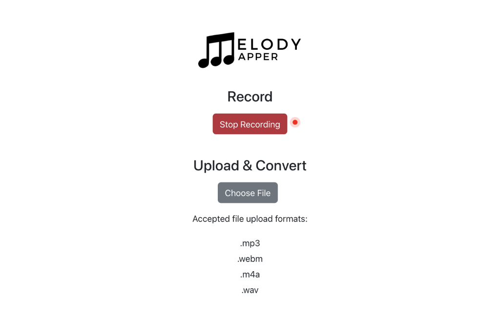
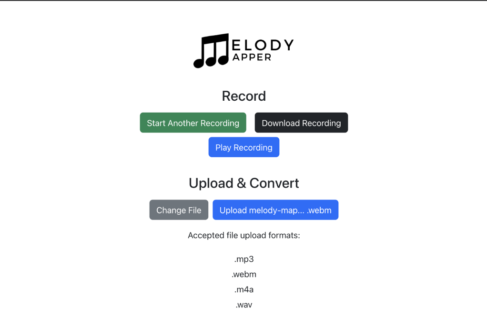
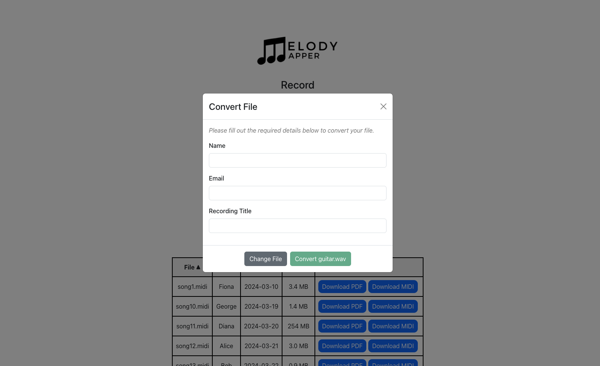
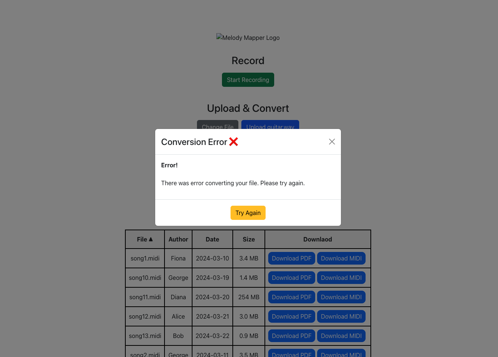
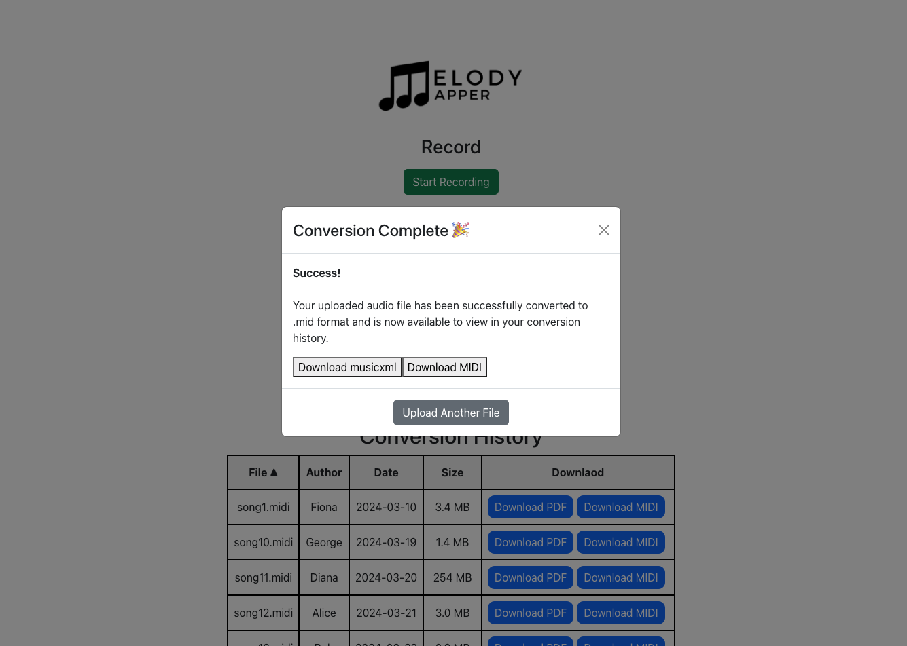

### Security Requirements

-   Our system will only record audio in between when the user has clicked the start and stop recording button.
-   Our system will only store the MIDI file converted from audio recordings.
    -   The system will state that the audio recordings will only be used for converting into the MIDI file.
    -   MIDI files will be stored in the database and open for all users to see.
    -   The system will not save audio recordings because users may want to avoid having their voice being recorded and stored on the system.
-   Our system will be vulnerable to denial-of-service attacks.

### System Requirements

| Library    | Description                                    |
| ---------- | ---------------------------------------------- |
| Flask      | A framework to work as a backend server        |
| Mido       | A library to work with MIDI format files       |
| music21    | A library to convert to musicxml file format   |
| SQLAlchemy | A library for Python to work with SQL database |

### Specification

#### Technology Stack

1. Javascript: React
2. REST API
3. Flask (Python)
4. SQLAlchemy
5. MySQL
6. Docker

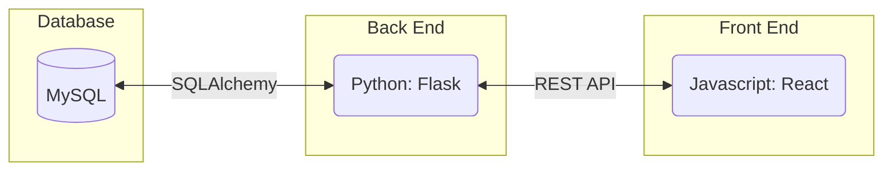

#### Database Schema

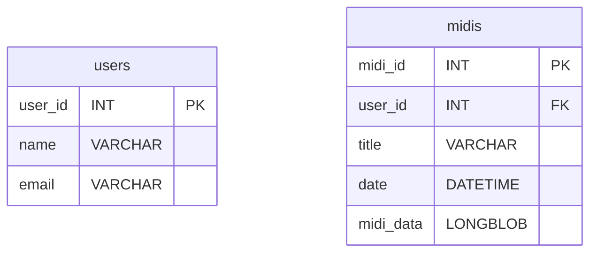

#### Class Diagram

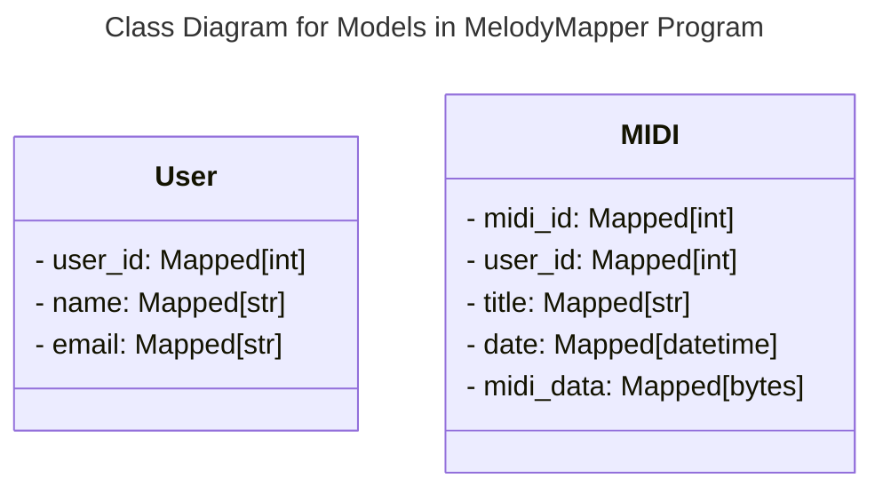

#### Flowchart

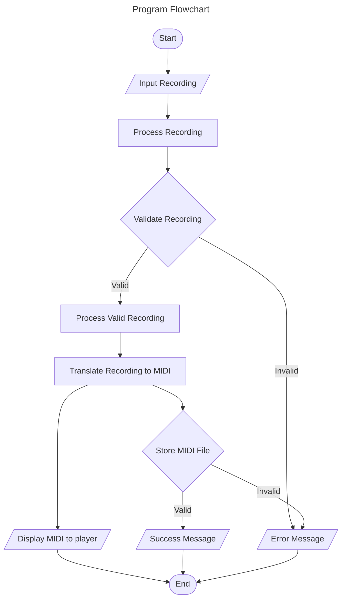

#### Behavior

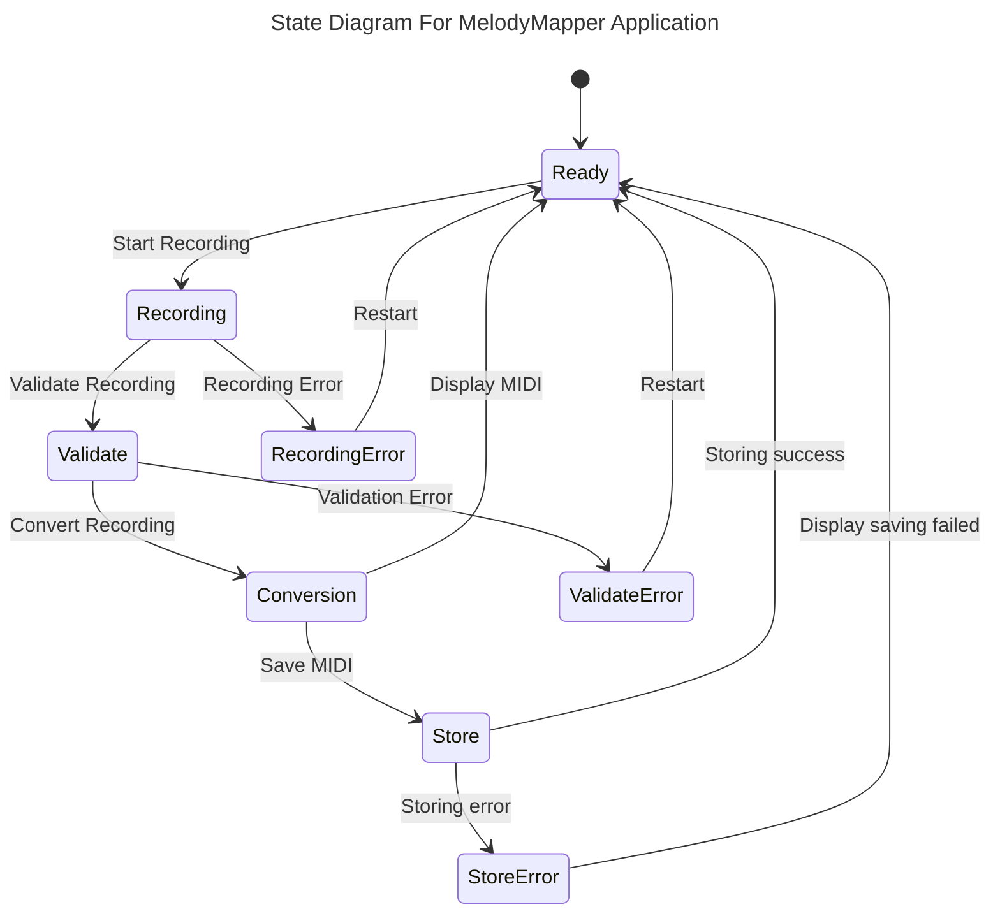

#### Sequence Diagram

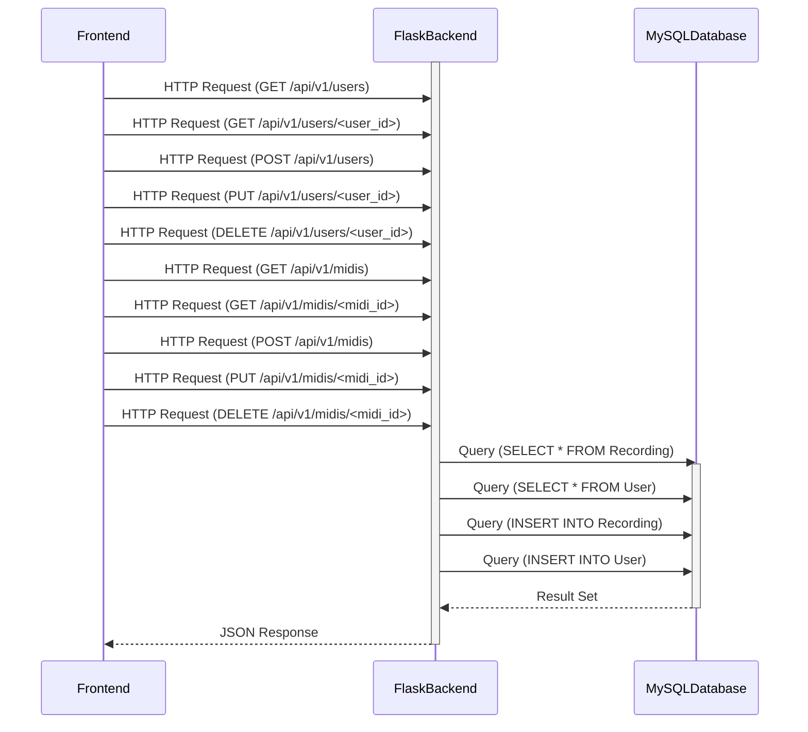

### Standards & Conventions

This portion of the document outlines the coding standards and conventions that are used in this project.

#### Coding Standards

The team prioritized the following coding standards during development:

1. **Simplicity:** Keep code simple which makes the code easier to understand, debug, and maintain.
2. **Modularity:** Encourages breaking down code into small, cohesive modules or functions that perform specific tasks.
3. **Scalability:** Write code that can scale to accommodate future growth in terms of efficiency and complexity.
4. **Consistency:** Enforce consistent naming conventions, formatting styles, and coding practices across the codebase.
5. **Documentation:** Include meaningful comments and documentation to explain complex logic, algorithms, or non-obvious behavior. Document public APIs, parameters, return values, and important implementation details.
6. **Version Control:** Utilize version control systems effectively to track changes, collaborate with team members, and manage codebase evolution. Follow branching and merging best practices to facilitate parallel development and code review processes.

#### Formatting Conventions

For Front End software development we use the VSCode extension [Prettier](https://marketplace.visualstudio.com/items?itemName=esbenp.prettier-vscode) in its default configuration.
Back End development uses the VSCode extension [Black Formatter](https://marketplace.visualstudio.com/items?itemName=ms-python.black-formatter) in its default configuration.
These extensions provide out of the box solutions that are lightweight and easy to use.

You can also read more about the Python PEP 8 standard [here](https://peps.python.org/pep-0008/).

#### Naming Conventions

1. **Compound Names:** Compound names should use upper case letters to mark the beginning of the next word "likeThis" and "LikeThisToo"
2. **User-defined Types:** Names of user-defined types (files, classes, or enumerated types) should begin with upper case letters "LikeThis" or "This"
3. **Functions:** Names of functions, including class methods, should begin with lower case letters "likeThis()" or "this()"
4. **Variables:** Names of variables should begin with a lower case letter "likeThis" or "this"
5. **Boolean Variables:** Boolean variables should be named as questions or states to reflect their meaning. For example: "isReady", "hasPermission"
   Constants: Names of constants should be written in uppercase letters with underscores separating words. For example: "MAX_SIZE", "PI_VALUE".
6. **Self-documenting Types and Functions:** Names of types and functions should be chosen to be self-documenting
7. **Meaningful Variables:** Names of meaningful variables should be chosen to be self-documenting. Names of variables whose function is internally important only, such as loop counters, should be simple.

#### Comment Conventions

1. **JavaScript:** For JavaScript functions, use JSDoc-style comments to provide documentation for functions. This includes a description of what the function does, parameters it accepts, and the return value.

```
/**
 * Calculate the sum of two numbers.
 *
 * @param {number} num1 - The first number.
 * @param {number} num2 - The second number.
 * @returns {number} The sum of num1 and num2.
 */
function sum(num1, num2) {
    return num1 + num2;
}
```

2. **Python:** For Python functions, use docstrings to document the purpose, parameters, and return values of the function.

```
def calculate_sum(num1, num2):
    """
    Calculate the sum of two numbers.

    Args:
        num1 (int): The first number.
        num2 (int): The second number.

    Returns:
        int: The sum of num1 and num2.
    """
    return num1 + num2

```

3. **TODO Comments:** Use TODO comments to mark areas of code that need improvement or additional work. Include a brief description of what needs to be done and any relevant context.

#### File Headers Conventions

1. **JavaScript:**

```
/******************************************************************************
 * Filename: [File Name]
 * Purpose:  [Brief description of the purpose or functionality of the file]
 * Author:   [Author Name]
 *
 * Description:
 * [Detailed description of the contents and functionality of the file.]
 *
 * Usage (Optional):
 * [Instructions or examples demonstrating how to use the code in this file.
 * Include any dependencies or prerequisites required for proper usage.]
 *
 * Notes:
 * [Any additional notes, considerations, or important information
 * about the file that may be relevant to developers or users.]
 *
 ******************************************************************************/
```

2. **Python:**

```
################################################################################
# Filename: [File Name]
# Purpose:  [Brief description of the purpose or functionality of the file]
# Author:   [Author Name]
#
# Description:
# [Detailed description of the contents and functionality of the file.]
#
# Usage (Optional):
# [Instructions or examples demonstrating how to use the code in this file.
# Include any dependencies or prerequisites required for proper usage.]
#
# Notes:
# [Any additional notes, considerations, or important information
# about the file that may be relevant to developers or users.]
#
###############################################################################
```

3. **Docker**

```
################################################################################
# Filename: [File Name]
# Purpose:  [Brief description of the purpose or functionality of the file]
# Author:   [Author Name]
#
# Description:
# [Detailed description of the contents and functionality of the file.]
#
# Usage (Optional):
# [Instructions or examples demonstrating how to use the code in this file.
# Include any dependencies or prerequisites required for proper usage.]
#
# Notes:
# [Any additional notes, considerations, or important information
# about the file that may be relevant to developers or users.]
#
###############################################################################
```


# Development
# Running Development Environment with Docker Compose

This guide outlines the process for configuring and launching the development environment for the project with Docker Compose. We utilize Docker volumes to facilitate a smoother development experience. This approach eliminates the need for restarting images to reflect changes made during development.

## Prerequisites

Docker installed on your machine.
Docker Compose installed on your machine.

## Steps to Run

1. Clone the Repository

If you haven't already, clone the project repository to your local machine.

```bash
git clone https://git.doit.wisc.edu/cdis/cs/courses/cs506/sp2024/team/mondaywednesdaylecture/T_05/MelodyMapper.
cd MelodyMapper
```

2. Build and Run the Services

Use the following Docker Compose command to build and run the services defined in the `docker-compose.yml` and `docker-compose.override.yml` files:

```bash
docker-compose up --build -d
```

This command will build the images for the services and start the containers in detached mode. The --build flag ensures that the images are built before the containers are started.

3. Access the Services

Once the containers are up and running, you can access the services at the following URLs:

General Domain: http://localhost:80/
Frontend: http://localhost:3000/
Backend: http://localhost:5000/
phpMyAdmin: http://localhost:8765/ (for database management)

4. View Logs (Optional)

To view the logs for the running containers, you can use the following command:

```bash
docker-compose logs -f
```

The -f flag will follow the log output, allowing you to see real-time logs in your terminal.

5. Stop the Services

When you're done, you can stop the running containers using the following command:

```bash
docker-compose down
```

This command will stop and remove the containers, networks, and volumes created by docker-compose up.

## Tips for Development

- You can make changes to your source code, and the changes will be reflected in the running containers as the volume mounts has been set up in Docker Compose configuration.
- If you need to rebuild the images after making changes to your Dockerfiles or dependencies, use the `docker-compose up --build` command again.

## FAQ

- If you encounter a port conflict, modify the ports configuration in docker-compose.override.yml. For example, change `- "5000:5000"` to `- "5123:5000"` to resolve a port conflict on port 5000.

# Deployment

This guide outlines the process to deploy the project in a production environment using Docker.

## Log into CSL VM

Access the specific directory:

```bash
cd /nobackup
```

## Clone the Repository

Clone the project repository:

```bash
git clone https://git.doit.wisc.edu/cdis/cs/courses/cs506/sp2024/team/mondaywednesdaylecture/T_05/MelodyMapper.git

cd MelodyMapper
```

## Build and Run Containers

Use Docker Compose to build and run the containers:

```bash
docker-compose -f docker-compose.prod.yml up --build -d
```

This command builds the images for your services and starts them in detached mode.

## Verifying Deployment

Verify the deployment:

- Ensure you are connected to the UW-Madison VPN to access internal resources.

- Access the project via http://cs506-team-05.cs.wisc.edu/.

## Updating the Deployment

To update the deployment with the latest changes from the repository:

1. Pull the latest changes:

   ```bash
   git pull origin main
   ```

2. Rebuild and restart the containers:
   ```bash
   docker-compose -f docker-compose.prod.yml up --build -d
   ```

This will ensure any updates made to the Docker configuration or application are applied.

## Notes

- Always check that the docker-compose.prod.yml file is configured correctly for production settings, such as environment variables and exposed ports.
